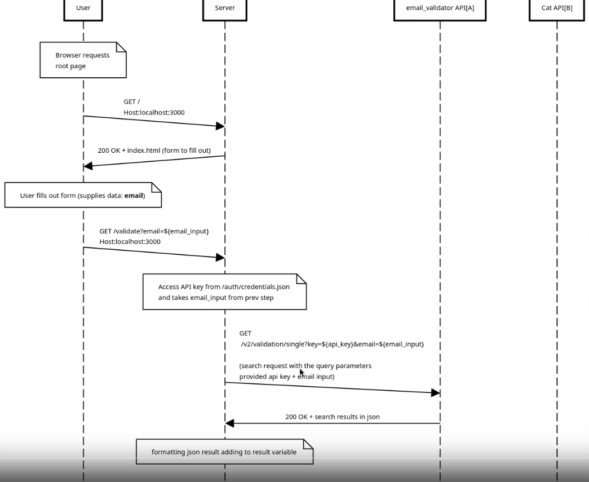
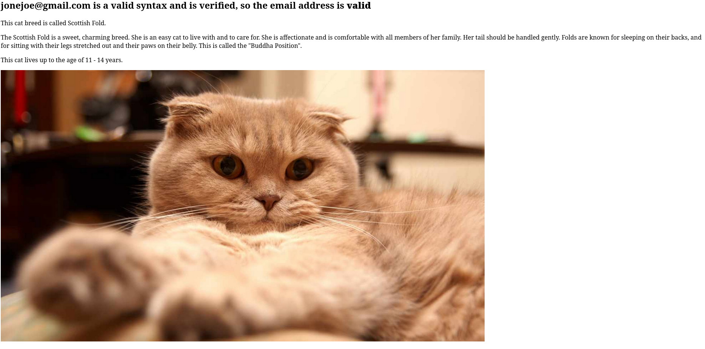

# Email Validator and Cat Image Generator

This is a Node.js web application that combines email validation with cat image generation. It provides a simple web interface where users can input an email address for validation. The application validates the email and displays information about its validity along with details and an image of a random cat breed.

## Table of Contents

- [Features](#features)
- [API Intergration](#api-intergration)
- [Setup Instructions](#setup-instructions)
- [Usage](#usage)
- [Project Structure](#project-structure)
- [Diagram](#diagram)
- [Demo](#demo)
- [License](#license)

## Features

- Email Validation: The application validates the email address using a simple validation logic.
- Cat Image Generation: On successful validation, it fetches and displays an image of a random cat breed.
- Image Caching: The application caches cat images to reduce the number of requests to the external API.

## API Integration

- **MailboxValidator API**: Used for email validation

  - Documentation: [MailboxValidator API Docs](https://www.mailboxvalidator.com/api-single-validation)

- **The Cat API**: Used for fetching cat breed information and images
  - Documentation: [The Cat API Docs](https://docs.thecatapi.com/)

## Setup Instructions

1. Clone the repository:

   ```
   git clone https://github.com/yubelgg/email-validator.git
   cd email-validator
   ```

2. Set up API keys:

   - Create a file named `credentials.json` in the `auth` directory with the following structure:
     ```json
     {
       "api_key": "your-mailboxvalidator-api-key",
       "cat_api_key": "your-cat-api-key"
     }
     ```
   - Replace `your-mailboxvalidator-api-key` with your MailboxValidator API key
   - Replace `your-cat-api-key` with your The Cat API key

3. Start the server:

   ```
   node index.js
   ```

4. Access the application by navigating to `http://localhost:3000` in your web browser.

## Usage

1. Open the application in your web browser.
2. Enter an email address in the provided input field.
3. Click the "validate" button to submit the form.
4. The application will display:
   - Email validation results
   - Information about a random cat breed
   - An image of the cat breed

## Project Structure

- `index.js`: Main server file containing the application logic
- `index.html`: HTML file for the web interface
- `auth/credentials.json`: File storing API keys
- `images/`: Directory for storing cached cat images

## Diagram



## Demo



## License

[MIT License](LICENSE)
